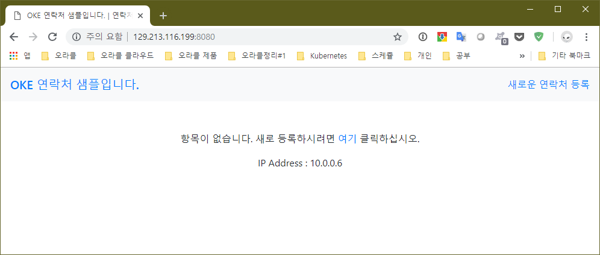
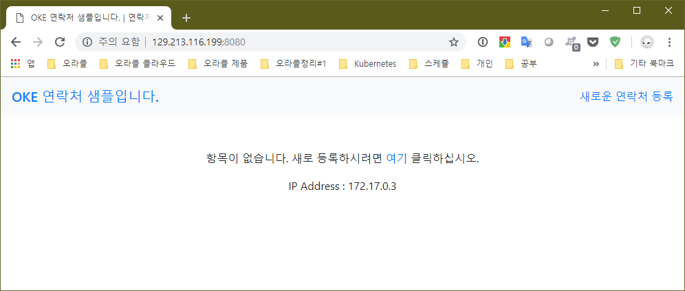

# 도커로 웹서비스 실행
1. VM의 접속주소는 `129.213.116.199` 입니다.
1. 브라우저를 통해서 `http://129.213.116.199:8080/`에 접속합니다. 
    프로그램이 동작중이 아님을 인지합니다.

1. https://hub.docker.com 으로 접속 후 "tomcat"을 검색
1. docker 실행
    ~~~sh
    $ docker run -it --rm -p 포트:8080 tomcat:8.0
    ~~~

    - `포트`는 주어진 8081~8089까지 user의 주어진 번호 끝자리로 합니다.
    - -it : 컨테이너와의 상호작용을 터미널과 동일한 환경으로 설정
    - --rm : 컨테이너가 종료되면 모든 정보가 사라짐
    - -p : 호스트의 포트와 컨테이너의 포트로 포워딩

    ~~~sh
    # Tomcat 실행
    $ docker run -it --rm -p 8081:8080 tomcat:8.0

    Unable to find image 'tomcat:8.0' locally
    Trying to pull repository docker.io/library/tomcat ...
    8.0: Pulling from docker.io/library/tomcat
    f189db1b88b3: Pull complete
    3d06cf2f1b5e: Pull complete
    edd0da9e3091: Pull complete
    eb7768aae14e: Pull complete
    e2780f585e0f: Pull complete
    e5ed720afeba: Pull complete
    d9e134700cfc: Pull complete
    e4804b33d02a: Pull complete
    b9df0c24315e: Pull complete
    49fdae8eaa20: Pull complete
    1aea3d9a32e6: Pull complete
    Digest: sha256:8ecb10948deb32c34aeadf7bf95d12a93fbd3527911fa629c1a3e7823b89ce6f
    Status: Downloaded newer image for tomcat:8.0
    Using CATALINA_BASE:   /usr/local/tomcat
    Using CATALINA_HOME:   /usr/local/tomcat
    Using CATALINA_TMPDIR: /usr/local/tomcat/temp
    Using JRE_HOME:        /docker-java-home/jre
    Using CLASSPATH:       /usr/local/tomcat/bin/bootstrap.jar:/usr/local/tomcat/bin/tomcat-juli.jar
    25-Feb-2019 02:22:49.498 INFO [main] org.apache.catalina.startup.VersionLoggerListener.log Server version:        Apache Tomcat/8.0.53
    25-Feb-2019 02:22:49.500 INFO [main] org.apache.catalina.startup.VersionLoggerListener.log Server built:          Jun 29 2018 14:42:45 UTC
    ...
    ~~~

1. 브라우저를 통해서 `http://129.213.116.199:포트/`에 접속합니다.

1. Tomcat 이 동작하고 있음을 알 수 있습니다.

1. Ctrl-C 를 눌러 종료합니다.

1. 완료하였습니다.

# 도커로 데이터베이스 실행
1. VM의 접속주소는 `129.213.116.199` 입니다.
1. https://hub.docker.com 으로 접속 후 "mysql"을 검색
1. docker 실행

    다음의 명령을 통하여 mysql을 실행합니다.
    ~~~sh
    $ docker run --name ${USER}-mysql -e MYSQL_ROOT_PASSWORD=Welcome1 -d mysql:5.7
    ~~~

    ~~~sh
    # MySQL 실행
    $ docker run --name ${USER}-mysql -e MYSQL_ROOT_PASSWORD=Welcome1 -d mysql:5.7

    Unable to find image 'mysql:5.7' locally
    Trying to pull repository docker.io/library/mysql ...
    5.7: Pulling from docker.io/library/mysql
    6ae821421a7d: Pull complete
    a9e976e3aa6d: Pull complete
    e3735e44a020: Pull complete
    bfd564e9483f: Pull complete
    df705f26e488: Pull complete
    0c5547f73d62: Pull complete
    f437382cf8a1: Pull complete
    4f22805bb6d6: Pull complete
    394f0f652697: Pull complete
    fb068b9b9d1f: Pull complete
    fdfc96ad0937: Pull complete
    Digest: sha256:8c15b2612051244d0a2b6ceb6f9bf82ddc0e909555c1067c098e5f935e2751a7
    Status: Downloaded newer image for mysql:5.7
    47045e03d3773cf24812d7b0774a3a5b8a9727961383beef074ec6f3c8023c84
    ...
    ~~~

1. mysql 에 접속하기

    exec 로 도커 컨테이너 내의 bash을 실행한 다음 mysql에 접속합니다.
    ~~~sh
    $ docker exec -it ${USER}-mysql bash
    > mysql -u root -pWelcome1
    ~~~

    ~~~sh
    # MySQL 접속하기
    $ docker exec -it ${USER}-mysql bash

    root@47045e03d377:/# mysql -u root -pWelcome1

    mysql: [Warning] Using a password on the command line interface can be insecure.
    Welcome to the MySQL monitor.  Commands end with ; or \g.
    Your MySQL connection id is 2
    Server version: 5.7.25 MySQL Community Server (GPL)

    Copyright (c) 2000, 2019, Oracle and/or its affiliates. All rights reserved.

    Oracle is a registered trademark of Oracle Corporation and/or its
    affiliates. Other names may be trademarks of their respective
    owners.

    Type 'help;' or '\h' for help. Type '\c' to clear the current input statement.

    mysql>
    ~~~

    MySQL이 동작하고 있음을 알 수 있습니다.

1. 컨테이너 속에서 나오기
    
    `exit`를 입력하고 mysql을 나옵니다.
    
    `exit`를 입력해서 컨테이너를 빠져나옵니다.

1. 컨테이너 삭제하기

    수행중인 컨테이너를 종료하고 해당 컨테이너를 삭제 합니다.  
    ~~~
    $ docker stop ${USER}_mysql
    $ docker rm ${USER}_mysql
    ~~~
    
1. container id 를 이용하여 컨테이너 삭제하기 (옵션)

    컨테이너에 특별한 이름을 부여하지 않았으면 `'CONTAINER ID'`를 이용하여 수행중인 컨테이너를 종료하고 해당 컨테이너를 삭제할 수도 있습니다.

    현재 수행중인 컨테이너의 리스트를 봅니다.
    ~~~
    $ docker ps -a
    ~~~

    표시된 `'CONTAINER ID'`를 이용하여 수행중인 컨테이너를 종료하고 해당 컨테이너를 삭제합니다.

    ~~~
    $ docker stop c44fbcf94c56
    $ docker rm c44fbcf94c56
    ~~~

1. 완료하였습니다.

# 애플리케이션 작성

Node.JS로 만들어진 사용자를 관리하는 애플리케이션을 작성해 보도록 합니다. 이 애플리케이션은 MySQL에 새로운 유저와 테이블을 사용합니다.

애플리케이션의 소스는 미리 만들어진 것을 가져와서 사용하고, MySQL은 미리 만들어진 도커 이미지를 사용합니다.

1. git 에서 기존에 만들어진 애플리케이션 소스를 가져옵니다.

    ~~~
    $ cd
    $ git clone https://github.com/jonggyoukim/sample-app
    ~~~

    sample-app 디렉토리로 이동을 합니다.
    ~~~
    $ cd sample-app
    ~~~

    
1. MySQL 컨테이너 실행하기

    ~~~
    $ docker run --name ${USER}-mysql -e MYSQL_ROOT_PASSWORD=Welcome1 -p 3306:3306 -d mysql:5.7 
    ~~~

1. 애플리케이션용 테이블 만들기

    ~~~sh
    $ docker exec -i ${USER}-mysql mysql -u root -pWelcome1 < ./create.sql
    ~~~

1. 애플리케이션 실행하기

    ~~~sh
    $ npm install
    $ npm start
    ~~~

1. 테스트 하기

    웹브라우저로 `http://129.213.116.199:8080/`을 접속해 봅니다.
    
    표시되는 IP Address가 현재 VM의 IP Address를 나타내고 있습니다.

1. 마치기

    테스트가 잘 되면 Ctrl-C 를 눌러 서비스를 마칩니다.

# 애플리케이션을 도커 이미지로 만들기

위에서 만든 애플리케이션을 도커이미지로 만들는 과정입니다.
도커이미지를 만들기 위해서 Dockerfile 이 필요하며 미리 생성되어 있습니다.

1. Dockerfile 살펴보기

    sample-app 디렉토리 내에 Dockerfile 이 있습니다.
    이 파일은 도커 이미지를 만들기 위한 설정파일입니다.
    ~~~docker
    # Node 버젼 8의 이미지를 기본으로 합니다.
    FROM node:8

    # 애플리케이션이 위치할 디렉토리를 생성합니다.
    WORKDIR /user/src/app

    # npm을 이용하여 필요한 패키지를 설치합니다.
    COPY package*.json ./
    RUN npm install

    # 모든 애플리케이션 파일을 복사합니다.
    COPY . .

    # 포트를 익스포즈 합니다.
    EXPOSE 8080

    # 애플리케이션를 실행합니다.
    CMD ["npm", "start"]
    ~~~

1. .dockerignore 살펴보기

    이 파일은 도커 이미지를 만들때 포함되지 않아야 할 항목을 나열한 파일입니다.

    ~~~docker
    node_modules
    npm-debug.log 
    ~~~

1. 도커 이미지 만들기
    ~~~sh
    $ cd sample-app
    $ docker build -t ${USER}-sample-app .
    ~~~

    다음과 같이 도커 이미지가 만들어집니다.
    ~~~sh
    # 도커 이미지 만들기
    $ docker build -t ${USER}-sample-app .

    Sending build context to Docker daemon  2.099MB
    Step 1/7 : FROM node:8
    ---> 4f01e5319662
    Step 2/7 : WORKDIR /user/src/app
    ---> Running in ba981429b55c
    Removing intermediate container ba981429b55c
    ---> cbb9451c4e29
    Step 3/7 : COPY package*.json ./
    ---> 902f1f20f4bc
    Step 4/7 : RUN npm install
    ---> Running in c0d2a804a56b
    ...
    ~~~

1. 이미지 확인하기

    만들어진 도커 이미지를 확인하기 위하여 다음의 명령을 내립니다.

    ~~~sh
    $ docker images
    ~~~

    다음과 같이 user1-sample-app 이 만들어져 있음을 알 수 있습니다.
    ~~~sh
    # 도커 이미지 확인하기
    $ docker images
    
    REPOSITORY           TAG                 IMAGE ID            CREATED              SIZE
    user1-sample-app     latest              7f88f43f85c9        About a minute ago   904MB
    user1/node-web-app   latest              19353c1ef997        5 hours ago          896MB
    mysql                5.7                 e47e309f72c8        2 weeks ago          372MB
    node                 8                   4f01e5319662        2 weeks ago          893MB
    tomcat               8.0                 ef6a7c98d192        5 months ago         356MB
    ~~~

# 애플리케이션을 컨테이너에서 수행하기

앞서 만든 애플리케이션 이미지를 사용하여 컨테이너를 실행해 보도록 합니다.

1. 옵션설정 : 필요한 환경변수 대입하기

    이 애플리케이션은 필요한 환경변수 `MYSQL_SERVICE_HOST`가 있습니다. 이 환경변수는 mysql 이 서비스 되고 있는 호스트를 나타낸니다. 설정하지 않으면 `localhost`로 대입되어 해당 애플리케이션 이미지에는 mysql이 존재하지 않아 애플리케이션이 동작하지 않습니다.

    도커에서 환경변수의 값은 `-e` 옵션을 사용하여 대입합니다.
    ~~~
    -e MYSQL_SERVICE_HOST=mysql
    ~~~

1. 옵션설정 : 다른 컨테이너 연결하기

    mysql은 현재 ${USER}_mysql 이라는 이름으로 서비스를 하고 있습니다. 예를 들어 애플리케이션이 접속하는 `mysql`이라는 서버가 `user1-mysql` 로 서비스 되고 있는 컨테이너에 접속해야 합니다. 그래서 컨테이너 끼리 열결하기 위해서 `--link`를 사용합니다.

    mysql 이라는 서버는 `${USER}-mysql`라고 서비스 되고 있는 컨테이너라고 대입하기 위해서 다음과 같은 옵션을 사용합니다.
    ~~~
    --link ${USER}-mysql:mysql
    ~~~

1. 옵션설정 : 포트 포워딩

    해당 애프리케이션은 8080 포트로 서비스 됩니다. 그래서 같은 포트로 포워딩 하기위해 다음과 같은 옵션을 사용합니다. 앞의 8080 은 호스트의 포트이고, 뒤의 8080은 컨테이너의 포트입니다.
    ~~~
    -p 8080:8080
    ~~~
    
    
1. 애플리케이션 실행하기

    최종적으로  다음과 같이 애플리케이션을 실행합니다.
    ~~~
    $ docker run --name ${USER}-app -e MYSQL_SERVICE_HOST=mysql --link ${USER}-mysql:mysql -p 8080:8080 -d ${USER}-sample-app
    ~~~

1. 테스트 하기

    웹브라우저로 `http://129.213.116.199:8080/`을 접속해 봅니다.
    
    이전에 애플리케이션으로 수행한 화면과 동일하지만, 표시되는 IP Address가 VM의 IP Address가 아닌 컨테이너의 IP Address를 나타내고 있습니다.

1. 완료

    이로써 애플리케이션을 도커이미지로 만들고, 컨테이너로 수행완료하였습니다.