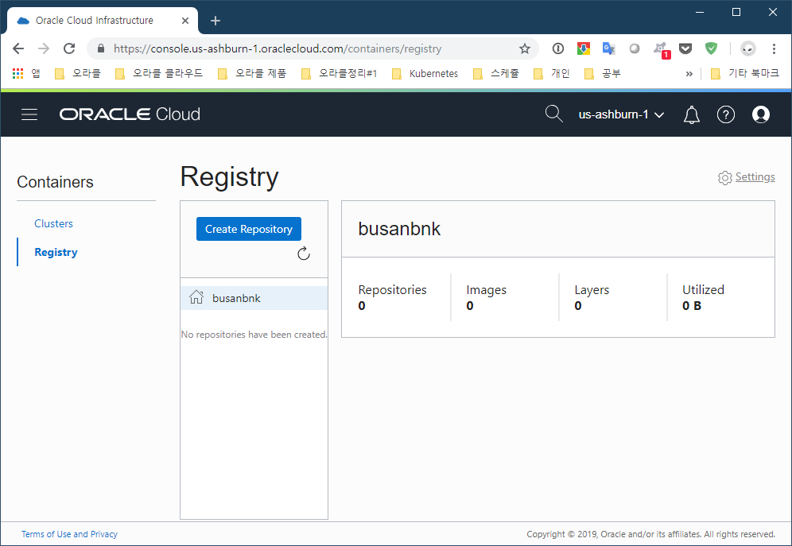
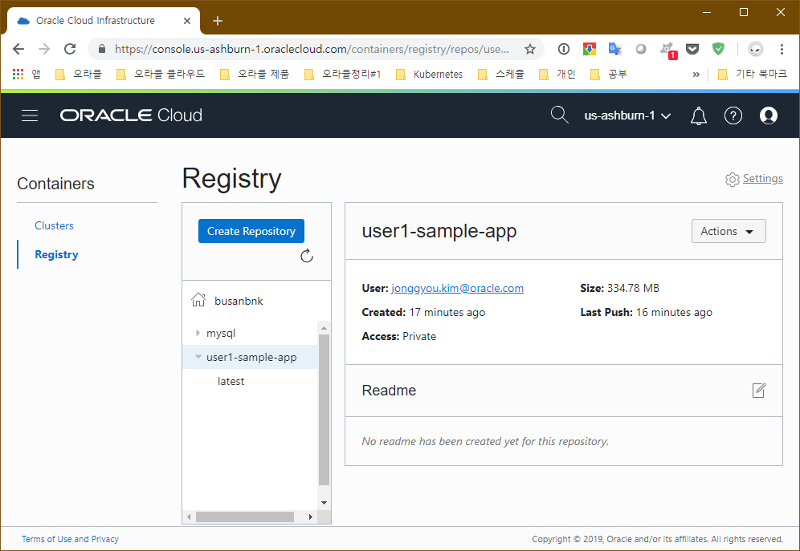
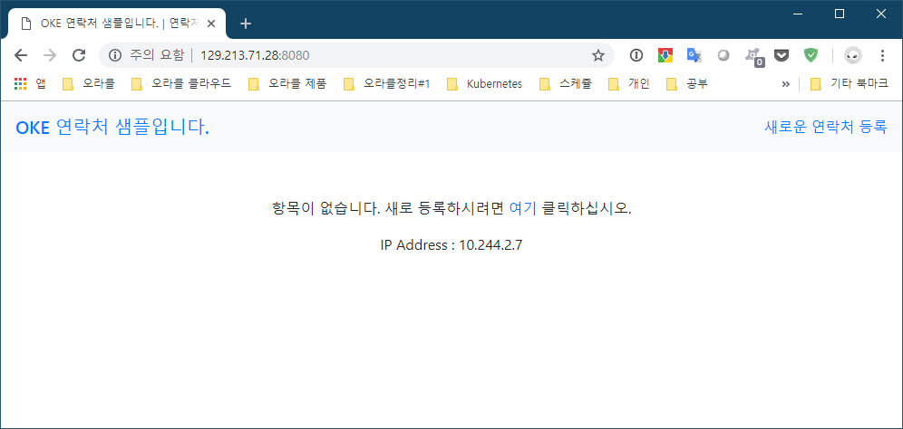

# 쿠베르네테스 (Kubernetes)

여러 도커 호스트를 관리하고 엔터프라이즈 급의 서비스를 위하여 쿠베르네테스가 사용됩니다.

오라클에서는 OKE(Oracle Container Engine for Kubernetes)라는 서비스를 제공합니다.

또한 도커 레지스트리로 OCIR (Oracle Cloud Infrastruccture Registry)를 제공하여 도커 이미지를 프라이빗으로 저장할 수 있습니다.

# httpd OKE에서 수행하기

OKE에서 docker hub에 있는 이미지들 컨테이너화 해 보도록 한다.

1. myhttpd 라는 애플리케이션 이름으로 컨테이너화 한다.
    ~~~
    $ kubectl run myhttpd --image=httpd
    kubectl run --generator=deployment/apps.v1beta1 is DEPRECATED and will be removed in a future version. Use kubectl create instead.
    deployment.apps/myhttpd created
    ~~~

1. 잘 수행되었는지 살펴본다.
    ~~~
    $ kubectl get deployment
    NAME                                               DESIRED   CURRENT   UP-TO-DATE   AVAILABLE   AGE
    hello                                              1         1         1            1           6h55m
    myhttpd                                            1         1         1            1           18s

    $ kubectl get service
    NAME                                               TYPE           CLUSTER-IP      EXTERNAL-IP       PORT(S)          AGE
    hello                                              LoadBalancer   10.96.70.35     129.213.141.145   8000:31291/TCP   6h43m
    kubernetes                                         ClusterIP      10.96.0.1       <none>            443/TCP          53d
    ~~~

1. myhttpd를 위한 service를 생성한다.
    ~~~
    $ kubectl expose deployment myhttpd --type=LoadBalancer --port=80
    service/myhttpd exposed
    ~~~

1. service를 살펴본다.
    ~~~
    $ kubectl get service
    NAME                                               TYPE           CLUSTER-IP      EXTERNAL-IP       PORT(S)          AGE
    hello                                              LoadBalancer   10.96.70.35     129.213.141.145   8000:31291/TCP   6h46m
    kubernetes                                         ClusterIP      10.96.0.1       <none>            443/TCP          53d
    myhttpd                                            LoadBalancer   10.96.199.17    129.213.190.27    80:31713/TCP     54s
    ~~~

1. 적혀진 EXTERNAL-IP로 접속해 본다.
    ~~~
    $ curl 129.213.190.27
    <html><body><h1>It works!</h1></body></html>
    ~~~ 

이와같이 docker hub에 있는 image들을 가져다 쓸 때에는 쉽게 가져다 쓴다.  
하지만 OCIR에 있는 이미지들은 private 한 영역이기 때문에 인증과정을 거쳐야 OKE에서 사용할 수 있다.

# OCIR에 컨테이너 로그인

1. OCIR 살펴 보기

    다음 화면은 오라클 OCI에서 제공하는 비공개 도커 레지스트리 화면입니다.
    
    현재 아무런 도커 이미지가 없어 비어있는 상태입니다.

1. OCIR 로그인 

    비공개 레지스트리인 OCIR에 로긴을 하기 위해서는 다음과 같이 로그인 합니다.

    ~~~
    $ docker login -u apackrsct01/<login id> iad.ocir.io

    Password:
    WARNING! Your password will be stored unencrypted in /home/user1/.docker/config.json.
    Configure a credential helper to remove this warning. See
    https://docs.docker.com/engine/reference/commandline/login/#credentials-store

    Login Succeeded
    ~~~

    비공개이기 때문에 아이디와 레지스트리 주소를 로그인 시 지정해주어야 합니다.
    

# hello 이미지 만들어서 레지스트리에 올리기

hello 디렉토리를 만들고 node.js 로 동작하는 샘플을 만들어 보도록 합니다. 

<-- 삼각형을 클릭하여 열어주세요. 기존에 만들었다면 다음으로 넘어갑니다.

~~~
$ mkdir hello
$ cd hello
~~~

server.js
~~~
var http = require('http');
var os = require('os');

var handleRequest = function(request, response) {
  console.log('Received request for URL: ' + request.url);
  response.writeHead(200);
  response.end('Hello World!' + os.hostname());
};
var www = http.createServer(handleRequest);
www.listen(8000);
console.log(os.hostname() + " Server listening..");
~~~

Dockerfile
~~~
FROM node:slim
EXPOSE 8000
COPY server.js .
CMD node server.js
~~~

hello 이미지를 만든다. (개인의 docker hub 아이디를 쓴다.)
~~~
$ docker build -t {docker.com username}/hello .

or

$ docker build -t {docker.com username}/hello -f Dockerfile .
~~~

태그를 수정합니다.
~~~
$ docker tag hello iad.ocir.io/apackrsct01/hello
~~~

레지스트리 등록한다. (push가 되지 않으면 로그인을 먼저 한다)
~~~
$ docker push iad.ocir.io/apackrsct01/sample-app
~~~

# hello 서비스 시작하기
1. secret 만들기

    쿠버네티스에서 도커 레지스트리에 접속하기 위해서 접속정보를 저장해야 합니다.
    ~~~sh
    # 예제
    $ kubectl create secret docker-registry ocirsecret --docker-server=iad.ocir.io --docker-username='apackrsct01/jonggyou.kim@oracle.com' --docker-password='3_o}SPqt)V{5k8pa3czw'
    ~~~
    로긴이 완료되면 다음과 같이 확인 가능합니다.
    ~~~sh
    # SECRET 보기
    $ kubectl get secret

    NAME                  TYPE                                  DATA   AGE
    default-token-qcnl4   kubernetes.io/service-account-token   3      2d
    ocirsecret            kubernetes.io/dockerconfigjson        1      24m
    ~~~

1. 실행하기

    다음과 같이 실행을 합니다.
    ~~~
    kubectl run --image=iad.ocir.io/apackrsct01/jonggyoukim/hello hello
    ~~~

    이렇게 하면 제대로 실행이 되지 않습니다. 왜냐하면 ocir 에 접근이 불가하기 때문입니다.  
    이를 해결하기 위해 yaml 파일을 받습니다.
    ~~~
    kubectl get deployment/hello -o yaml > ./hello.yaml
    ~~~
    그리고 아래와 같이 다음 부분을 추가합니다.
    ~~~

    add
        imagePullSecrets:
        - name: ocirsecret
    kubectl apply -f hello.yaml
    kubectl expose deployment hello --type=LoadBalancer --port=80
    kubectl get service
    kubectl delete service hello
    ~~~

# 두개 이상의 연결된 서비스 배포 

1. App 이미지 태그 설정

    역시 애플리케이션 이미지를 OCIR에 넣기 위해서는 태그를 설정해야 합니다.
    ~~~
    $ docker tag sample-app iad.ocir.io/apackrsct01/sample-app
    ~~~

    도커 이미지를 살펴보면 다음과 같습니다.
    ~~~
    $ docker images

    REPOSITORY                              TAG                 IMAGE ID            CREATED             SIZE
    sample-app                              latest              7f88f43f85c9        About an hour ago   904MB
    iad.ocir.io/apackrsct01/sample-app      latest              7f88f43f85c9        About an hour ago   904MB
    user1/node-web-app                      latest              19353c1ef997        6 hours ago         896MB
    mysql                                   5.7                 e47e309f72c8        2 weeks ago         372MB
    node                                    8                   4f01e5319662        2 weeks ago         893MB
    ~~~
    iad.ocir.io/apackrsct01/sample-app 이 존재합니다.

1. OCIR에 이미지 등록

    docker push 명령어로 도커 이미지를 도커 레지스트리에 저장합니다.

    애플리케이션을 레지스트리에 등록합니다.
    ~~~
    $ docker push iad.ocir.io/apackrsct01/sample-app

    The push refers to repository [iad.ocir.io/apackrsct01/sample-app]
    1e3e8a895da2: Pushed
    2501822996fb: Pushed
    399ef710ae23: Pushed
    9b72d867bdd7: Pushed
    c315992b27e9: Pushed
    e9f2ab8c5040: Pushed
    8579c758b9d0: Pushed
    a22a5ac18042: Pushed
    6257fa9f9597: Pushed
    578414b395b9: Pushed
    abc3250a6c7f: Pushed
    13d5529fd232: Pushed
    latest: digest: sha256:6e42eedf567a96159e9d2fea507830e0433e4385ffa0c47538b422c7713faa93 size: 2845
    ~~~

    이로서 이미지 등록을 완료하였습니다.

    OCIR에 등록된 이미지는 다음과 같이 보여지게 됩니다.
    
    
    도커 레지스트리로 hub.docker.com 과 iad.ocir.io 를 사용함의 큰 차이는 공개/비공개입니다.

# OKE에 애플리케이션 컨테이너 배포

1. PersistentVolume 만들기

    MySQL은 데이터를 저장할 볼륨이 필요합니다. 
    
    이를 위한 mysql-pv.yaml 파일입니다.
    ~~~yaml
    kind: PersistentVolume
    apiVersion: v1
    metadata:
      name: mysql-pv-volume
      labels:
        app: oke-sample
        type: local
    spec:
      storageClassName: manual
      capacity:
        storage: 2Gi
      accessModes:
        - ReadWriteOnce
      hostPath:
        path: "/mnt/data"
    ---
    apiVersion: v1
    kind: PersistentVolumeClaim
    metadata:
      name: mysql-pv-claim
      labels:
        app: oke-sample
    spec:
      storageClassName: manual
      accessModes:
        - ReadWriteOnce
      resources:
        requests:
        storage: 2Gi 
    ~~~

    실행은 다음과 같이 합니다.
    ~~~
    $ kubectl create -f mysql-pv.yaml
    ~~~

1. MySQL 배포

    MySQL 배포를 위한 mysql-deployment.yaml 입니다.
    
    ~~~yaml
    apiVersion: v1
    kind: Service
    metadata:
      name: mysql
      labels:
        app: oke-sample
    spec:
      ports:
      - port: 3306
      selector:
        app: mysql
    #  clusterIP: None
    ---
    apiVersion: apps/v1
    kind: Deployment
    metadata:
      name: mysql
      labels:
        app: oke-sample
    spec:
      selector:
        matchLabels:
        app: mysql
      strategy:
        type: Recreate
      template:
        metadata:
          labels:
            app: mysql
        spec:
          containers:
          - image: mysql:5.7
            name: mysql
            env:
            - name: MYSQL_ROOT_PASSWORD
              value: Welcome1
            ports:
            - containerPort: 3306
            name: mysql
            volumeMounts:
            - name: mysql-persistent-storage
            mountPath: /var/lib/mysql
        imagePullSecrets:
        - name: ocirsecret
        volumes:
        - name: mysql-persistent-storage
            persistentVolumeClaim:
              claimName: mysql-pv-claim 
    ~~~
    
    실행은 다음과 같이 합니다.
    
    ~~~
    $ kubectl create -f mysql-deployment.yaml
    ~~~

    MySQL에 접속하여 테이블을 만듭니다.
    
    1. pod을 살펴본다.
        ~~~
        $ kubectl get pods

        NAME                          READY   STATUS    RESTARTS   AGE
        mysql-765686d4dc-vmssq        1/1     Running   0          27m
        ~~~
    2. 컨테이너에 접속한다.
        ~~~
        $ kubectl exec -it mysql-765686d4dc-vmssq bash
        
        root@mysql-765686d4dc-vmssq:/#
        ~~~
    3. mysql에 접속해서 쿼리를 실행한다.
        ~~~
        root@mysql-765686d4dc-vmssq:/# mysql -u root -pWelcome1
        
        mysql: [Warning] Using a password on the command line interface can be insecure.
        Welcome to the MySQL monitor.  Commands end with ; or \g.
        Your MySQL connection id is 11
        Server version: 5.7.25 MySQL Community Server (GPL)

        Copyright (c) 2000, 2019, Oracle and/or its affiliates. All rights reserved.

        Oracle is a registered trademark of Oracle Corporation and/or its
        affiliates. Other names may be trademarks of their respective
        owners.

        Type 'help;' or '\h' for help. Type '\c' to clear the current input statement.

        mysql>
        ~~~
    4. exit 를 입력하여 mysql을 빠져나오고, 다시 exit 를 입력하여 컨테이너를 빠져나온다.

    이로서 MySQL에 대한 설정이 완료하였습니다.

1. App 배포

    애플리케이션 배포를 위한 app-deployment.yaml 입니다.

    ~~~yaml
    apiVersion: v1
    kind: Service
    metadata:
      name: oke-sample
      labels:
        app: oke-sample
    spec:
      ports:
      - port: 8080
      selector:
        app: oke-sample
        tier: frontend
      type: LoadBalancer

    ---
    apiVersion: apps/v1
    kind: Deployment
    metadata:
      name: oke-sample
      labels:
        app: oke-sample
    spec:
      selector:
        matchLabels:
          app: oke-sample
          tier: frontend
      strategy:
        type: Recreate
      template:
        metadata:
        labels:
            app: oke-sample
            tier: frontend
        spec:
          containers:
          - image: iad.ocir.io/apackrsct01/sample-app
            name: oke-sample
            env:
            - name: MYSQL_SERVICE_HOST
              value: "mysql"
            - name: MYSQL_SERVICE_USER
              value: "test"
            - name: MYSQL_SERVICE_PASSWORD
              value: "Welcome1"
            - name: MYSQL_SERVICE_DATABASE
              value: "sample"
            ports:
            - containerPort: 8080
            name: oke-sample
        imagePullSecrets:
        - name: ocirsecret 
    ~~~
    
    실행은 다음과 같이 합니다.
    
    ~~~
    $ kubectl create -f app-deployment.yaml
    ~~~

1. 테스트

    pod 확인
    ~~~    
    $ kubectl get pods

    NAME                          READY   STATUS    RESTARTS   AGE
    mysql-765686d4dc-vmssq        1/1     Running   0          11m
    oke-sample-5957f86d8f-4qv9l   1/1     Running   0          2m
    ~~~

    배포 확인
    ~~~    
    $ kubectl get deployments

    NAME         DESIRED   CURRENT   UP-TO-DATE   AVAILABLE   AGE
    mysql        1         1         1            1           11m
    oke-sample   1         1         1            1           2m
    ~~~

    서비스 확인
    ~~~
    $ kubectl get service

    NAME         TYPE           CLUSTER-IP      EXTERNAL-IP     PORT(S)          AGE
    kubernetes   ClusterIP      10.96.0.1       <none>          443/TCP          2d
    mysql        ClusterIP      10.96.107.120   <none>          3306/TCP         11m
    oke-sample   LoadBalancer   10.96.41.195    129.213.71.28   8080:32517/TCP   2m
    ~~~

    결과 중 LoadBalancer 형태의 EXTERNAL-IP 부분이 실제 외부로 서비스 되는 IP입니다.

    웹브라우저를 이용하여 해당 IP와 8080포트로 접속을 하면 동일한 화면을 볼 수 있습니다.

    

# 스케일 아웃

1. 현재 상태 보기

    현재 배포상태 보기
    ~~~
    $ kubectl get deployments

    NAME         DESIRED   CURRENT   UP-TO-DATE   AVAILABLE   AGE
    mysql        1         1         1            1           34m
    oke-sample   1         1         1            1           25m
    ~~~

    현재 pod 상태 보기
    ~~~
    $ kubectl get pods
    NAME                          READY   STATUS    RESTARTS   AGE
    mysql-765686d4dc-vmssq        1/1     Running   0          34m
    oke-sample-5957f86d8f-4qv9l   1/1     Running   0          25m
    ~~~

    현재 1개의 POD 에서 애플리케이션이 수행되고 있음을 알 수 있습니다.
    
1. Scale Out

    스케일 아웃을 수행합니다. 3개의 애플리케이션으로 설정합니다.
    ~~~
    $ kubectl scale deployment oke-sample --replicas=3
    deployment.extensions/oke-sample scaled
    ~~~

    현재 배포상태를 살펴보면 3개로 바뀐것을 알 수 있습니다.
    ~~~
    [user1@apackrsct01bank oke]$ kubectl get deployments
    NAME         DESIRED   CURRENT   UP-TO-DATE   AVAILABLE   AGE
    mysql        1         1         1            1           35m
    oke-sample   3         3         3            3           26m
    ~~~

    현재 POD을 보면 전체 3개가 동작됨을 알 수 있습니다.
    ~~~
    [user1@apackrsct01bank oke]$ kubectl get pods
    NAME                          READY   STATUS    RESTARTS   AGE
    mysql-765686d4dc-vmssq        1/1     Running   0          35m
    oke-sample-5957f86d8f-4qv9l   1/1     Running   0          26m
    oke-sample-5957f86d8f-g2dnd   1/1     Running   0          43s
    oke-sample-5957f86d8f-psmkt   1/1     Running   0          43s
    ~~~

    현재 서비스 상태를 봅니다.
    ~~~
    $ kubectl get services

    NAME         TYPE           CLUSTER-IP      EXTERNAL-IP     PORT(S)          AGE
    kubernetes   ClusterIP      10.96.0.1       <none>          443/TCP          2d
    mysql        ClusterIP      10.96.107.120   <none>          3306/TCP         39m
    oke-sample   LoadBalancer   10.96.41.195    129.213.71.28   8080:32517/TCP   30m
    ~~~

    로드밸런서의 외부IP인 http://129.213.71.28:8080 로 접속을 여러번 해 보면, 애플리케이션에서 나타내는 로컬 IP가 3개의 서버 IP를 랜덤으로 나타납니다.
